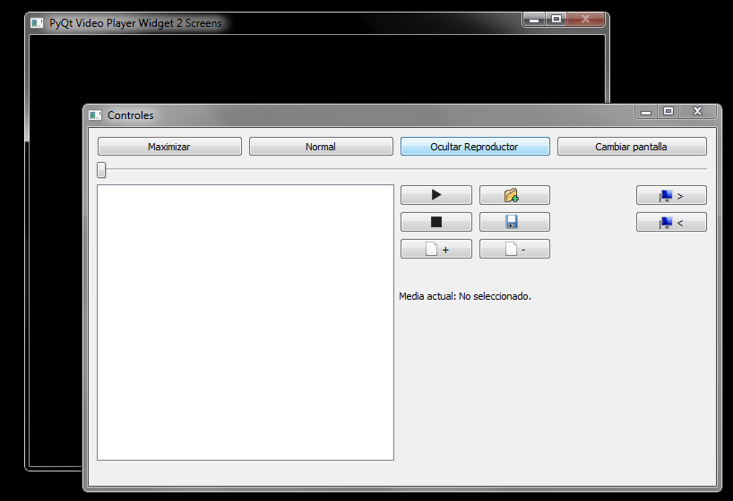

# pyTestScreen [WINDOWS|LINUX]
Reproductor de video con controles separados de la ventana del video para su uso en dos o más pantallas. 
Muestra los controles en una ventana: 
 
Y los videos en otra: 
  
Permite cambiar el tamaño de la ventana, maximizar la ventana, ocultar la ventana, cambiar la ventana de pantalla cuando se tiene más de una, reproducir, pausar, detener, guardar listas y abrir listas desde los controles, sin necesidad de interactuar directamente con la ventana del reproductor. 
 
 
Usa:  
PyQt5.QtCore               - QDir, Qt, QUrl 
PyQt5.QtMultimedia         - QMediaContent, QMediaPlayer, QMediaPlaylist 
PyQt5.QtMultimediaWidgets  - QVideoWidget 
PyQt5.QtWidgets            - QApplication, QFileDialog, QHBoxLayout, QLabel, QPushButton, QSizePolicy, QSlider, QStyle, QVBoxLayout, QWidget, QGridLayout,QDesktopWidget, QMainWindow,QWidget, QPushButton, QAction, QListWidget, QMessageBox 
PyQt5.QtGui                - QIcon 
sys 
os 
