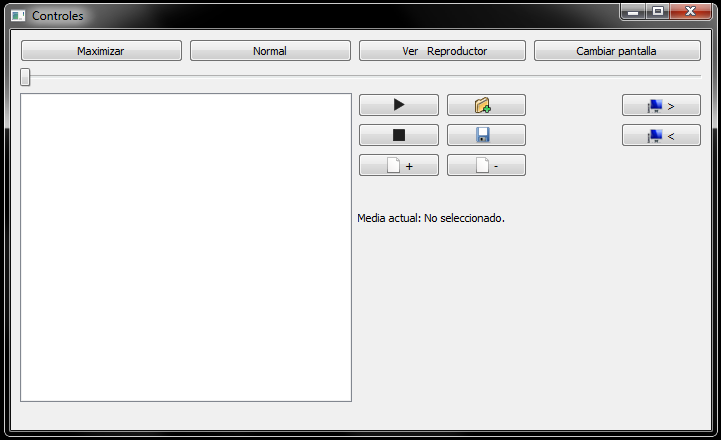
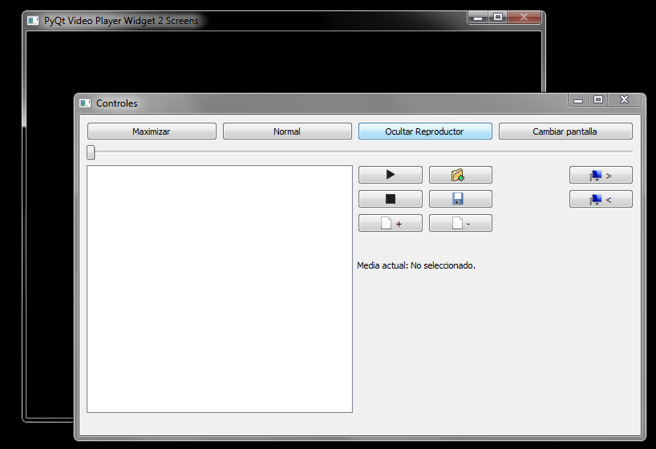
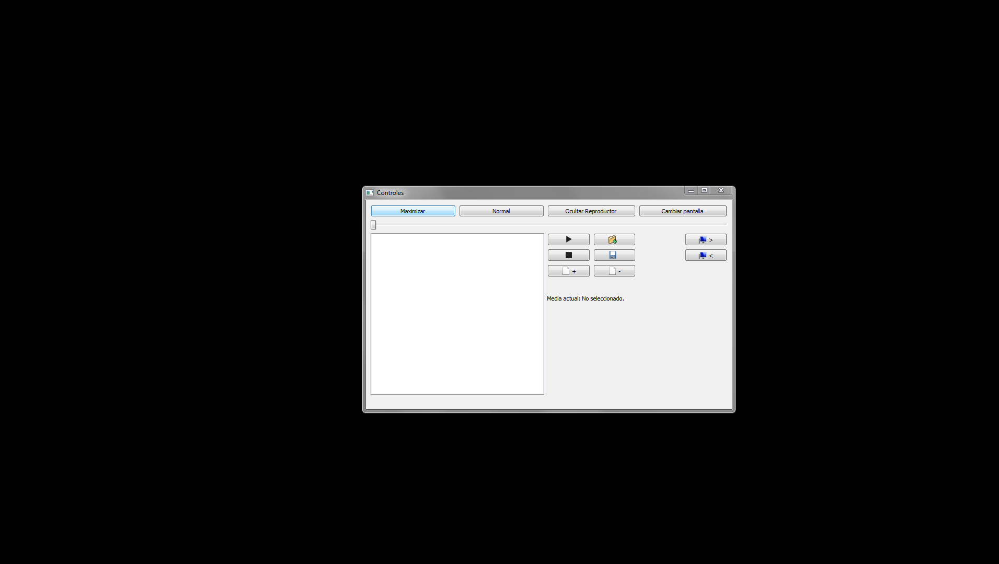

# pyTestScreen
Reproductor de video en dos pantallas para presentaciones.
Muestra los controles en una ventana:

Y los videos en otra:

Permite cambiar el tamaño de la ventana, maximizar la ventana, ocultar la ventana, cambiar la ventana de pantalla cuando se tiene más de una, reproducir, pausar, detener, guardar listas y abrir listas desde los controles, sin necesidad de interactuar directamente con la ventana del reproductor.

